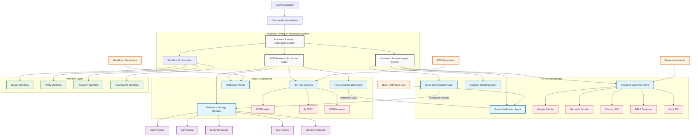

```mermaid
graph TD
    %% Main System Components
    User[User/Researcher] --> CLI[Command Line Interface]
    CLI --> MainSystem[Academic Research Automation System]
    
    %% Main System Division
    subgraph "Academic Research Automation System"
        MainSystem --> ARAS[Academic Research Agent System]
        MainSystem --> PREA[PDF Reference Extraction Agent]
        MainSystem --> Workflows[Workflow Orchestration]
    end
    
    %% ARAS Components
    subgraph "ARAS Components"
        ARAS --> ResearchDiscovery[Research Discovery Agent]
        ARAS --> SourceVerification[Source Verification Agent]
        ARAS --> CitationFormatting[Citation Formatting Agent]
        ARAS --> ArasOrchestration[ARAS Orchestration Agent]
        
        %% ARAS Data Sources
        ResearchDiscovery --> GoogleScholar[Google Scholar]
        ResearchDiscovery --> SemanticScholar[Semantic Scholar]
        ResearchDiscovery --> Crossref[Crossref API]
        ResearchDiscovery --> DBLP[DBLP Database]
        ResearchDiscovery --> ArXiv[ArXiv API]
    end
    
    %% PREA Components
    subgraph "PREA Components"
        PREA --> PDFTextExtractor[PDF Text Extractor]
        PREA --> ReferenceParser[Reference Parser]
        PREA --> ReferenceStorage[Reference Storage Manager]
        PREA --> PreaOrchestration[PREA Orchestration Agent]
        
        %% PREA Extraction Methods
        PDFTextExtractor --> PDFPlumber[PDFPlumber]
        PDFTextExtractor --> PyPDF2[PyPDF2]
        PDFTextExtractor --> OCR[OCR/Tesseract]
    end
    
    %% Workflow Types
    subgraph "Workflow Types"
        Workflows --> Extract[Extract Workflow]
        Workflows --> Verify[Verify Workflow]
        Workflows --> Research[Research Workflow]
        Workflows --> FullAnalysis[Full Analysis Workflow]
    end
    
    %% Input Types
    PDFInput[PDF Documents] --> PDFTextExtractor
    MarkdownInput[Markdown Documents] --> ReferenceParser
    JSONInput[JSON Reference Lists] --> SourceVerification
    ResearcherInput[Researcher Names] --> ResearchDiscovery
    
    %% Output Types
    ReferenceStorage --> JSONOutput[JSON Output]
    ReferenceStorage --> CSVOutput[CSV Output]
    ReferenceStorage --> ExcelOutput[Excel Workbooks]
    ReferenceStorage --> TextOutput[Text Reports]
    ReferenceStorage --> MarkdownOutput[Markdown Reports]
    
    %% Integration Points
    PreaOrchestration --> |Reference Data| SourceVerification
    ArasOrchestration --> |Verification Results| ReferenceStorage
    
    %% Styling
    classDef system fill:#f9f9f9,stroke:#333,stroke-width:2px
    classDef agent fill:#e1f5fe,stroke:#01579b,stroke-width:2px
    classDef workflow fill:#e8f5e9,stroke:#2e7d32,stroke-width:2px
    classDef input fill:#fff3e0,stroke:#e65100,stroke-width:2px
    classDef output fill:#f3e5f5,stroke:#6a1b9a,stroke-width:2px
    classDef datasource fill:#ffebee,stroke:#b71c1c,stroke-width:1px
    
    class MainSystem,ARAS,PREA system
    class ResearchDiscovery,SourceVerification,CitationFormatting,ArasOrchestration,PDFTextExtractor,ReferenceParser,ReferenceStorage,PreaOrchestration agent
    class Extract,Verify,Research,FullAnalysis workflow
    class PDFInput,MarkdownInput,JSONInput,ResearcherInput input
    class JSONOutput,CSVOutput,ExcelOutput,TextOutput,MarkdownOutput output
    class GoogleScholar,SemanticScholar,Crossref,DBLP,ArXiv,PDFPlumber,PyPDF2,OCR datasource
```
